# nguyenlamthuyphuong25.github.io
<html lang="en">
<head>
	<meta charset="UTF-8">
	<title>Phuong's profile</title>
	<link rel="stylesheet" href="Myprofile.css">
	
</head>
<header>
	<h1><u>NguyenLamThuyPhuong</u></h1>
</header>
<body>
	<section>
		<h2>About me</h2>
		<h3>My name is Phuong, or you can call me Yoshi. I was borned in Ho Chi Minh city in a big family (big not rich meow meow!). In my childhood, I have a big passion in computer. Ironically, I have a predestined relationship with literature in almost my student time and I don't have time for researching computer. Of course, I used to be a specialized literature student in Le Hong Phong highschool for the gifted. During the final period of high school, I decided to study IT in university, a career that was completely opposite of what I had studied before. My friend just looked at me and "OMG! HOW???". During that day, although it's a bit difficult, I'm still living well with my passion and I still have a special love for computers!</h3>
		

			
Overall, I am ...
 
			
Nguyen Lam Thuy Phuong

			
20 years old

			
2nd year student in Software Engineering in FPT University

			
Updating...

		

	</section>
	<section>
		<h2>What's in my own life?</h2>
			
I'm an introvert and simple person. 

		<figure>
			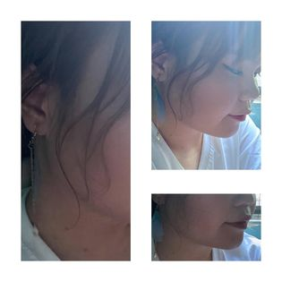
		</figure>
			
I also like simple things :3! like...

		<figure>
			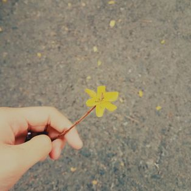
			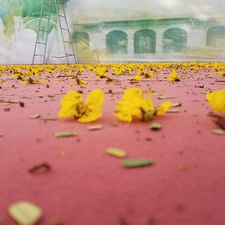
			<figcaption>A little flower...Or a lot of flowers, but they're flowers for breaking up!</figcaption>
		</figure>
			
I like to catch pics with flowers too!

		<figure>
			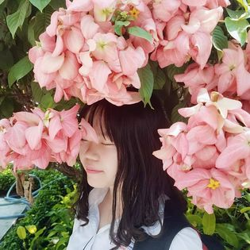
			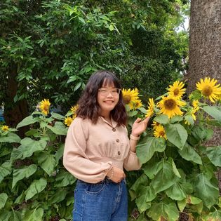
			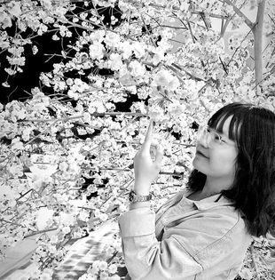
			<figcaption>I don't know why I like taking pictures with flowers, maybe because it's close to my color...</figcaption>
		</figure>

			
Sometimes, I write what I especially like...

		<figure>
			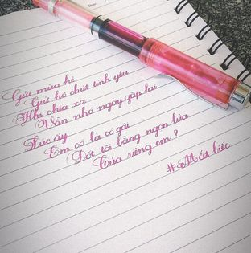
			<figcaption>I like to call this my own spiritual world!</figcaption>
		</figure>
			
And in life, I feel very very lucky because I have so many good friends!

		<figure>
			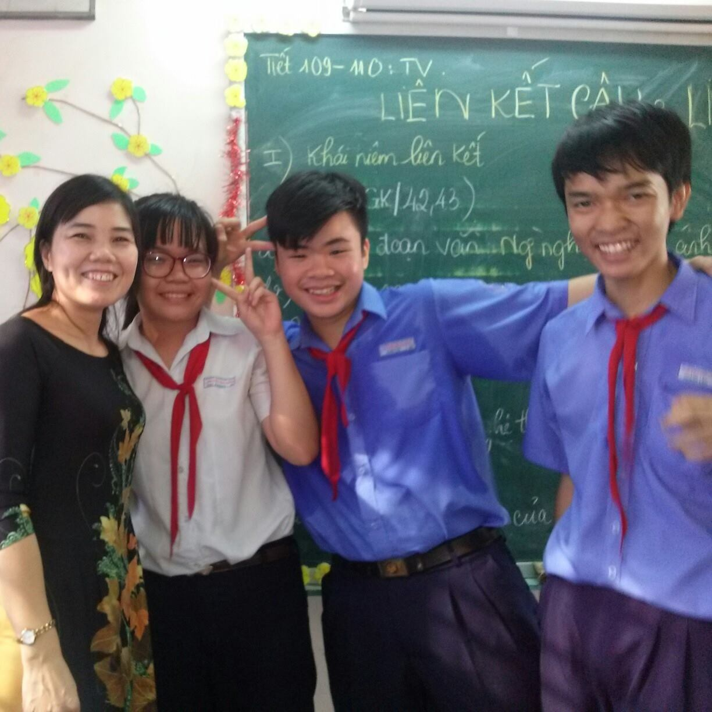
			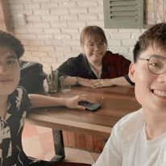
			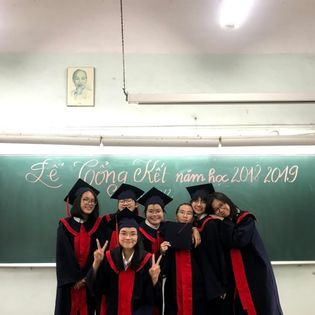
			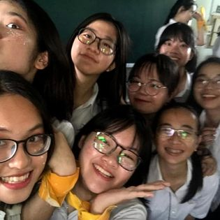
			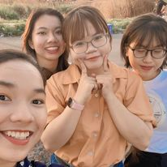
			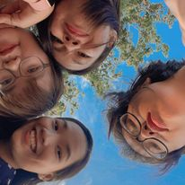
			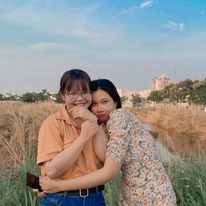
			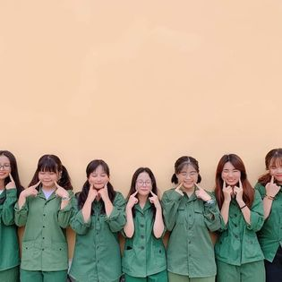
			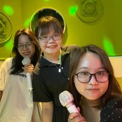
			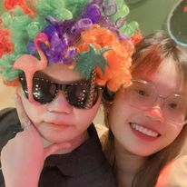
			<figcaption>I don't know why we got to know each other, but I know that we had some good times that I will remember forever in my life. Thanks for all!</figcaption>
		</figure>
	</section>
	<footer>
		<h4>More about me, contact me with...
		<a href="https://www.facebook.com/NLTPTTN"><i class="fab fa-facebook fa-x"></i></a>
		<a href="https://www.instagram.com/ryo2001_nguyen/"><i class="fab fa-instagram fa-x"></i></a>
		</h4>
	</footer>
</body>
</html>

